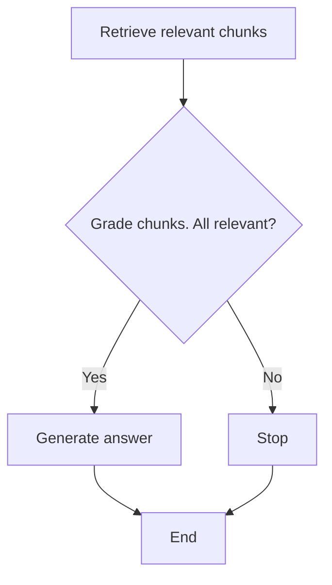

# RAG-based Question Answering on PDF Files

This repository contains an graph-based implementation of a Retrieval-Augmented Generation (RAG) system for answering questions based on user-uploaded PDF files. The notebook uses various tools and libraries to process PDF files, create embeddings, and generate answers using an OpenAI model.

The decision logic is implemented as a graph shown below. 



When user uplodas a file it gets processed, indexed in vector database. When user asks 
a question top N closest text chunks are picked up from the vector store. Then the application
assesses if the provided chunks are relevant to the question and if yes, proceeds to generate
an answer. If any of the documents is not relevant to the question the application
refuses to answer saying there is not enough context retrived to generate the answer.

# Running the system

1. Clone the repository:
    ```bash
    git clone https://github.com/alexs00/ragproto.git
    cd ragproto
    ```

2. You can create and run the project in a Docker container:
    ```bash
    docker build -t rag_proto .
    docker run  -p 8888:8888 \
    -e AZURE_OPENAI_API_KEY='your_api_key' \
    -e AZURE_OPENAI_ENDPOINT='your_api_endpoint' \
    -e AZURE_DEPLOYMENT_TEXTGEN='RAGProto' \
    -e AZURE_DEPLOYMENT_EMBED='RAGProtoEmbed' \
    -e AZURE_OPENAI_VERSION='2023-07-01-preview' \
    --name ragproto -d rag_proto
    ```
    You can access the notebook navigating to http://127.0.0.1:8888/

Alternatively you can run it locally as follows

## Requirements

- Python 3.12.2
- Jupyter Notebook
- Libraries specified in `requirements.txt`

## Installation

2. Create and activate a virtual environment (optional but recommended):
    ```bash
    python3 -m venv venv
    source venv/bin/activate
    ```

3. Install the required packages:
    ```bash
    pip install -r requirements.txt
    ```

4. Set up environment variables:
    Create a `.env` file in the root directory and add your Azure OpenAI API credentials:
    ```dotenv
    AZURE_OPENAI_API_KEY=your_api_key
    AZURE_OPENAI_ENDPOINT=your_api_endpoint
    AZURE_DEPLOYMENT_TEXTGEN=your_deployment_textgen
    AZURE_DEPLOYMENT_EMBED=your_deployment_embed
    AZURE_OPENAI_VERSION=your_api_version
    ```

## Usage

1. Launch Jupyter Notebook:
    ```bash
    jupyter notebook
    ```

2. Open `rag_proto.ipynb` in the Jupyter interface.

3. Follow the steps in the notebook to upload PDF files, split text, create embeddings, and perform question-answering.

# Notebook Contents

- **Initialization**: Imports necessary libraries and sets up environment variables.
- **Model Setup**: Defines the language models and embedding models using Azure OpenAI services.
- **File Upload and Processing**: Allows users to upload PDF files and processes them to extract text.
- **Text Splitting**: Splits the extracted text into manageable chunks for embedding.
- **Embedding and Indexing**: Creates embeddings for the text chunks and indexes them for retrieval.
- **Question Answering**: Implements the RAG process to retrieve relevant text chunks and generate answers.
- **Unit Tests**: Contains unit tests for the indexing and processing functions.

## Unit Tests

The notebook includes unit tests to ensure the correctness of the document indexing process. To run the tests:

1. Ensure that the test documents are in the `test_docs` directory.
2. Run the tests using the following command within the notebook:
    ```python
    !python -m unittest discover -s tests
    ```

# Productizations considerations
There numerour was the app can be improved and expanded to make it more robust:
- Proper logging and unit tests
- Separate app UI
- File upload progress 
- File upload API
  - Parallel file uploads
  - Managing duplicate files
  - Checking files for malicious content: executable code, prompt escaping attempts, etc
  - Check for valid PDF structure
- Instead of "playing" with chunk sizes it would be more robust to use documents' structure for
splitting, i.e. use sections as chunks
- Think of potential problems like network partition and provide fallback options and 
gracefull degradation functionality (use local simpler model for relevancy grading and 
remote powerfull one for answer generation, fallback to local with a warning message
if remote is not accessible)
- Potentially check final answer for halisinations
- Use semantic ranking to improve the relevancy of retrived chunks

There many imprvement options, however their prioritization depends on the concrete specific
use case being productized.