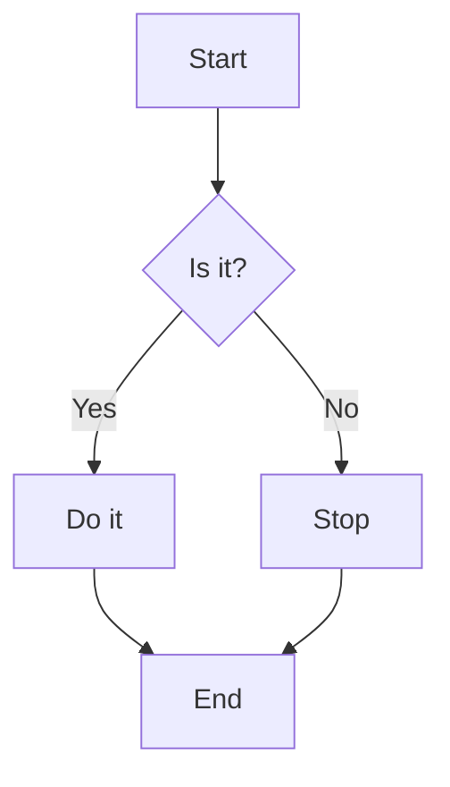

### Example of a Mermaid Diagram

```markdown
# Example Diagram in README.md


```mermaid
graph TD;
    A[Start] --> B{Is it?};
    B -->|Yes| C[Do it];
    B -->|No| D[Stop];
    C --> E[End];
    D --> E;
```mermaid

```
graph TD;
    A-->B;
    A-->C;
    B-->D;
    C-->D;
```

